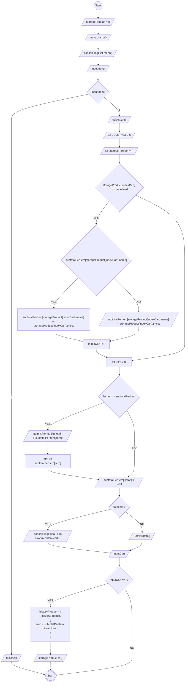

```mermaid

flowchart TD
A@{shape: circle, label: "Start"}
Z@{shape: dbl-circ, label: "Start"}

B@{shape: lean-r, label: "storageProduct = []" }
C@{shape: lean-r, label: "menuUtama()" }
D@{shape: lean-r, label: "console.log('list menu')" }
E@{shape: lean-r, label: "inputMenu" }
F@{shape: diam, label: "inputMenu" }
G@{shape: lean-r, label: "calcuCart()" }
H@{shape: lean-r, label: "rl.close()" }
I@{shape: lean-r, label: "let = indexCart = 0" }
J@{shape: lean-r, label: "let subtotalPerItem = {}" }
K@{shape: diam, label: "storageProduct[indexCart] !== undefined" }
L@{shape: diam, label: "subtotalPerItem[storageProduct[indexCart].name]" }
M@{shape: rect, label: " subtotalPerItem[storageProduct[indexCart].name] +=
        storageProduct[indexCart].price;"}
N@{shape: lean-r, label: " subtotalPerItem[storageProduct[indexCart].name] = storageProduct[indexCart].price;"}
O@{shpae: lean-r, label: "indexCart++;"}
P@{shpae: lean-r, label: "let total = 0;"}
Q@{shape: diam, label: "let item in subtotalPerItem"}
R@{shape: lean-r, label: "Item: ${item}, Subtotal: ${subtotalPerItem[item]}"}
S@{shape: rect, label: "total += subtotalPerItem[item]"}
T@{shape: lean-r, label: "subtotalPerItem['Total'] = total"}
U@{shape: diam, label: "total == 0"}
V@{shape: lean-r, label: " console.log('Tidak ada Produk dalam cart');"}
W@{shape: lean-r, label: "Total: ${total}"}
X@{shape: lean-r, label: "inputCart"}
Y@{shape: diam, label: "inputCart == 'y'"}
AA@{shape: rect, label: "historyProduct = [
        ...historyProduct,
        {
          items: subtotalPerItem,
          total: total
        }
      ];"}
BB@{shape: lean-r, label: " storageProduct = []"}

A-->B
B-->C
C-->D
D-->E
E-->F
F-- 2 --> G
F -- 4--> H
H --> Z
G --> I
I --> J
J-->K
K -- YES --> L
L -- YES --> M
L-- NO --> N
M-->O
N-->O
O-->P
K-->P
P-->Q
Q--YES-->R
R-->S
S-->T
Q--NO-->T
T-->U
U--YES--> V
U--NO-->W
V-->X
W-->X
X-->Y
Y--YES-->AA
AA-->BB
BB-->Z
Y--NO-->Z


```
