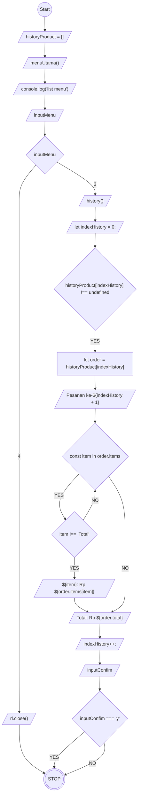

```mermaid
flowchart TD
A@{shape: circle, label: "Start"}
Z@{shape: dbl-circ, label: "STOP"}

B@{shape: lean-r, label: "historyProduct = []" }
C@{shape: lean-r, label: "menuUtama()" }
D@{shape: lean-r, label: "console.log('list menu')" }
E@{shape: lean-r, label: "inputMenu" }
F@{shape: diam, label: "inputMenu" }
G@{shape: lean-r, label: "history()" }
H@{shape: lean-r, label: "rl.close()" }
I@{shape: lean-r, label: "let indexHistory = 0;" }
J@{shape: diam, label: "historyProduct[indexHistory] !== undefined"}
K@{shpae: lean-r, label: "let order = historyProduct[indexHistory]"}
L@{shape: lean-r, label: "Pesanan ke-${indexHistory + 1}"}
M@{shape: diam, label: "const item in order.items"}
N@{shape: diam, label: "item !== 'Total'"}
O@{shape: lean-r, label: "${item}: Rp ${order.items[item]}"}
P@{shape: lean-r, label: "Total: Rp ${order.total}"}
Q@{shape: lean-r, label: "indexHistory++;"}
R@{shape: lean-r, label: "inputConfim"}
S@{shape: diam, label: "inputConfim === 'y'"}


A-->B
B-->C
C-->D
D-->E
E-->F
F--3-->G
F--4-->H
H-->Z
G-->I
I-->J
J--YES-->K
K-->L
L-->M
M--YES-->N
N --YES-->O
N--NO-->M
O-->P
M--NO-->P
P-->Q
Q-->R
R-->S
S--YES-->Z
S--NO-->Z

```