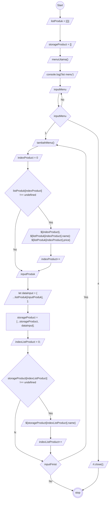

```mermaid

flowchart TD
A@{shape: circle, label: "Start"}
B@{shape: lean-r, label: "listProduk = [{}]" }
C@{shape: lean-r, label: "storageProduct = []" }
D@{shape: lean-r, label: "menuUtama()" }
E@{shape: lean-r, label: "console.log('list menu')" }
F@{shape: lean-r, label: "inputMenu" }
G@{shape: diam, label: "inputMenu" }
H@{shape: lean-r, label: "tambahMenu()" }
I@{shape: lean-r, label: "indexProduct = 0" }
J@{shape: diam, label: "listProduk[indexProduct] !== undefined" }
K@{shape: lean-r, label: "${indexProduct}. ${listProduk[indexProduct].name}: ${listProduk[indexProduct].price}" }
L@{shape: lean-r, label: "indexProduct++"}
M@{shape: lean-r, label: "inputProduk"}
N@{shape: lean-r, label: "let dataInput = {
      ...listProduk[inputProduk],
    };"}
O@{shape: rect, label: "storageProduct = [...storageProduct, dataInput];"}
P@{shape: lean-r, label: "indexListProduct = 0;"}
Q@{shape: diam, label: "storageProduct[indexListProduct] !== undefined"}
R@{shape: lean-r, label: "${storageProduct[indexListProduct].name}"}
S@{shape: lean-r, label: "indexListProduct++"}
T@{shape: diam, label: "inputFinist"}
U@{shape: dbl-circ, label: "stop"}
V@{shape : lean-r, label : "  rl.close();"}


A--> B
B---> C
C --> D
D --> E
E --> F
F --> G
G -- 1 --> H
G -- 4 --> V
G -- No --> F
H --> I
I --> J
J --Yes--> K
J-- No --> M
K --> L
L --> M
M --> N
N --> O
O --> P
P-->Q
Q--Yes--> R
Q--No--> T
R-->S
S-->T
T-- No -->U
T -- Yes -->H 
V --> U


```